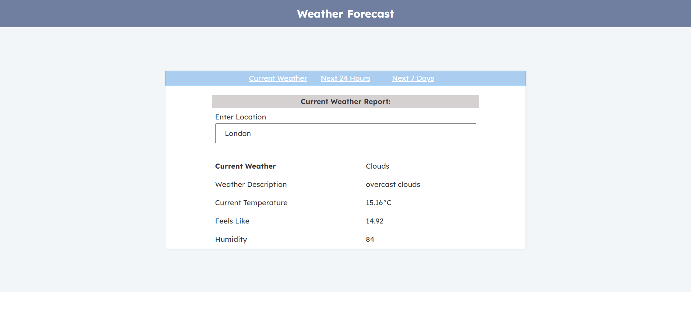
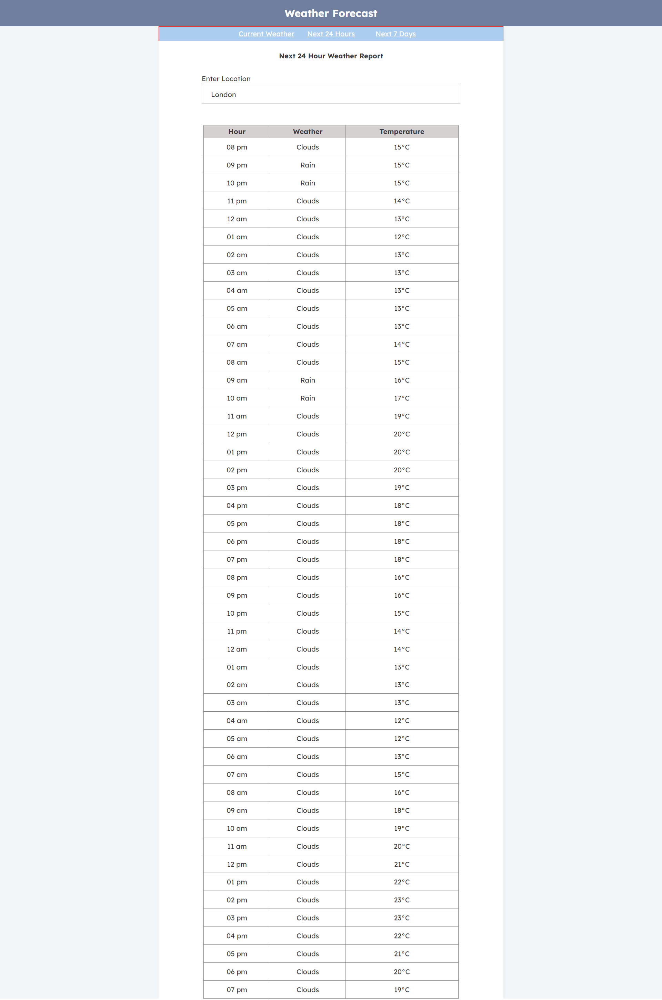
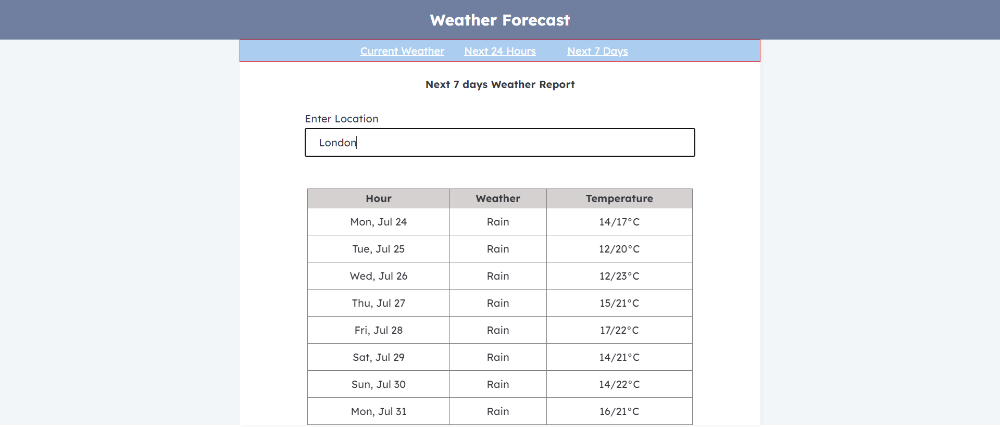

## About Project
A small application for weather forecast that interacts with the OpenWeather API (One Call API 3.0 - OpenWeatherMap) https://openweathermap.org/api/one-call-3.
- Server part built in laravel 9.52.10
- Front end part built in React 18.2.0

## Project Requirements

- PHP 8.0.29 
- Node Js v16.2.0
- Composer 2.5.8
- npm 7.13.0

## API used
 - https://openweathermap.org/api/one-call-3 API to fetch weather forecast
 - https://openweathermap.org/api/geocoding-api API to fecth latitude and longitude

## How to setup
 - Download project from git
 - cd weatherforecast
 ### APi server
 - In .env file add your OpenWeatherMap API key in  API_ID  variable
 - php artisan serve - this will make the api server up and running
 - By default the API server will be accessble using  http://127.0.0.1:8000/api
 
 ### Front end
  - from weatherforecast folder 
  - cd frontend
  - Correct the API server url 'proxy' in package.json file. Default value is http://127.0.0.1:8000/api
  - npm start 
  - The above command will make the front end up and running in http://localhost:3000/

  #### Current Weather 
  - Url : http://localhost:3000/
  - Display current weather of the given place
  - 

  #### Next 24 hour Weather 
  - Url : http://localhost:3000/dayWeather
  - Display weather forecast for the next 24 hours
  - 

  #### Next 7 days Weather 
  - Url : http://localhost:3000/weeklyWeather
  - Display weather forecast for the next 7 days
  - 
